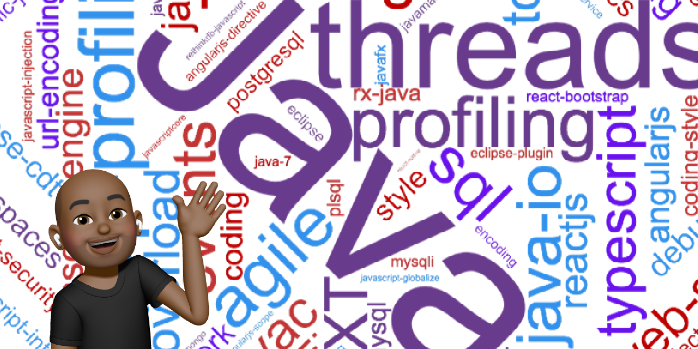

# Hello and **WELCOME** to my **Github** 👋🏾

As a relatively new developer, I'm excited to showcase my skills in CSS, HTML, and JavaScript. I have a passion for web development and a desire to create visually stunning and user-friendly websites. These repos feature some of my best work and demonstrate my eagerness to learn and grow as a web developer, particularly in my understanding and implementation of JavaScript. So please, take a moment to browse and let's work together to create something beautiful and functional!

 

 

# Languages

 

 

 

# Connect

 

 

 

 

# Other

